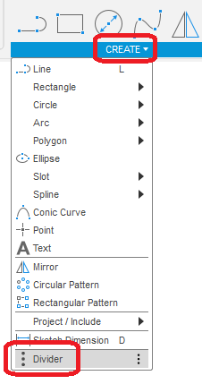
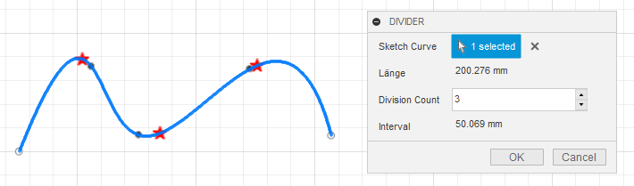
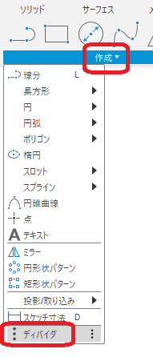
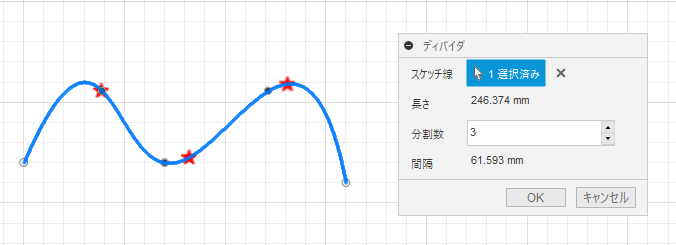

# ***Fusion360_SketchToolPlus Divider***

---

Creates equally spaced points on the specified sketch curve.

---
## Panel:
The command is added to the "create" of the working sketch.

  

## Usage:

After the command is executed, a dialog box appears.

  

- Sketch line : Select a line or curve in the sketch you are working on.
  - 3D curves are also OK.
  - For curves from other sketches, use "Include 3D geometry" in advance.

- Length : Length of the selected line

- Number of divisions: Enter the number of points to be created.
  - Open lines (e.g., straight lines): create the entered number of points between the start and end points.
  - Closed line (e.g. circle): Creates the number of points between the start and end points plus one (end point).

- Interval : Distance between points.

## **Remaining problems** :
- Re-editing is not possible.
- Only one line can be targeted.
- Sketch constraints are not yet finalized.

---

## **Action** :

The following environment is confirmed.

- Fusion360 Ver2.0.16490
- Windows10 64bit Pro , Home

---

# *** 以下は日本語です。***

---

指定したスケッチ曲線に等間隔の点を作成します。

---
## パネル:

スケッチ作業中の"作成"内にコマンドが追加されます。

  

## 使用法:

コマンド実行後、ダイアログが表示されます。

  

- スケッチ線 : 作業中のスケッチ内の直線・曲線を選択してください。
  - 3D曲線もOKです。
  - 他のスケッチの曲線の場合は、事前に "3Dジオメトリを含める" を利用してください。

- 長さ : 選択された線の長さ

- 分割数 : 作成する点の数を入力して下さい。
  - 開いている線（直線 等） : 始点-終点間に入力された数の点を作成します。
  - 閉じている線（円 等） : 始点-終点間に入力された数 +1個（終点）の点を作成します。

- 間隔 : 点-点間の距離

## 残された問題:
- 再編集が出来ない。
- 対象となる線は1本の線に制限。
- スケッチ拘束類の仕様が未確定。

## アクション:
以下の環境で確認しています。
 + Fusion360 Ver2.0.16490
 + Windows10 64bit Pro , Home