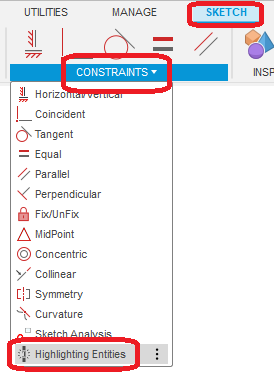
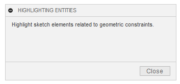
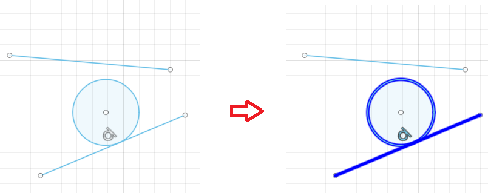
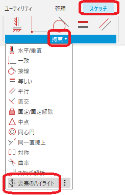
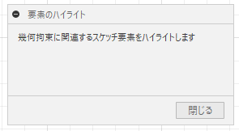

# ***Fusion360_SketchToolPlus HighlightingEntities***

---

Highlight shape elements in the under-constrained sketch.

---
## Panel:

It will be added to the "Constraints" section of the sketch workspace.

  

## Usage:
After the command is executed, a dialog box appears.

  

While the dialog is displayed, selecting a geometric constraint will cause the associated sketch element to be intensely highlighted.

  

---

## **Action** :

The following environment is confirmed.

- Fusion360 Ver2.0.16490
- Windows10 64bit Pro , Home

---

# *** 以下は日本語です。***

---

選択された幾何拘束に関連する要素を強調表示します。

---
## パネル:

スケッチ作業スペース時の "拘束" に "要素のハイライト" コマンドが追加されます。

  

## 使用法:

コマンド実行後、ダイアログが表示されます。

  

ダイアログを表示している間、幾何拘束を選択すると関連するスケッチ要素が強めにハイライトされます。

  )

## アクション:
以下の環境で確認しています。
 + Fusion360 Ver2.0.16490
 + Windows10 64bit Pro , Home