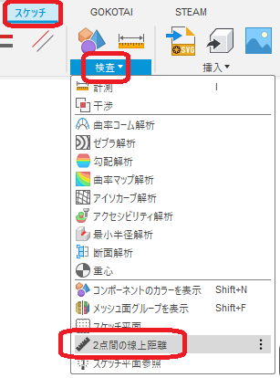

# ***Fusion360_SketchToolPlus PointsDistanceOnCurve***

---

Measures the distance between two points on a curve.

---
## Panel:
The command is added to the "inspection" of the working sketch.

  

This command appears in the menu even when you are not working on a sketch, but you cannot use it.

  

## Usage:

After the command is executed, a dialog box appears.

  

- Sketch lines: Select the sketch curves that will be used as support.

- Sketch points: Select two sketch points to measure distances.
  - Only points on the sketch line can be selected.

- Result: Displays the result when a curve and two points are selected.
  - Support Length: Length of the entire curve
  - Distance: Distance on the curve between the two points

The section where the measurement was taken is indicated by a red star.

  

---

## **Action** :

The following environment is confirmed.

- Fusion360 Ver2.0.16490
- Windows10 64bit Pro , Home

---

# *** 以下は日本語です。***

---

曲線上の2点間の距離を測定します。

---
## パネル:

スケッチ作業中の"検査"内にコマンドが追加されます。

  

スケッチ作業ではない時にもメニューに表示されますが、使用する事は出来ません。

  

## 使用法:

コマンド実行後、ダイアログが表示されます。

  

- スケッチ線：サポートとなるスケッチ曲線お選択します。

- スケッチ点：距離を測定するスケッチの点を2個選択します。
  - 選択出来る点はスケッチ線上の点のみです。

- 結果：曲線と2点を選択した時に結果を表示します・
  - サポート長さ：曲線全体の長さ
  - 距離：2点間の曲線上の距離

測定を行った区間を、赤い星印で表示します。

  

## アクション:
以下の環境で確認しています。
 + Fusion360 Ver2.0.16490
 + Windows10 64bit Pro , Home