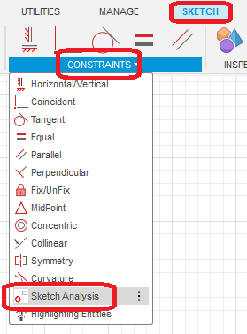
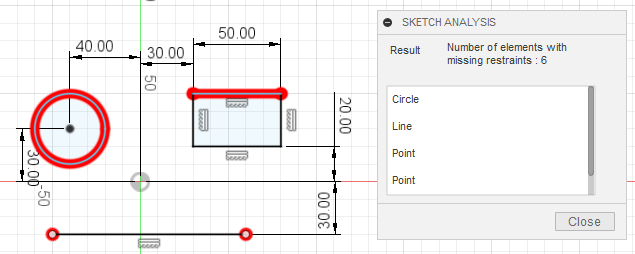
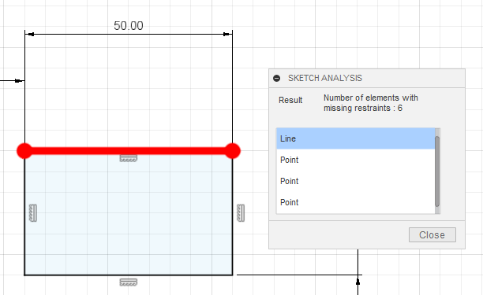
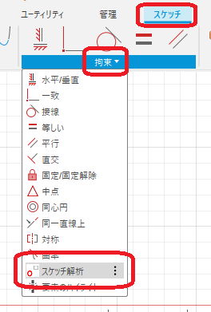
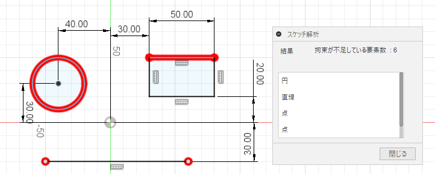
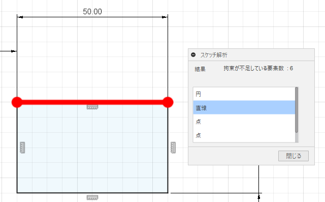

# ***Fusion360_SketchToolPlus SketchAnalysis***

***

Highlight shape elements in the under-constrained sketch.

***
## Panel:

It will be added to the "Constraints" section of the sketch workspace.

  

## Usage:

After the command is executed, the under-constrained elements are highlighted and the number of elements is displayed in the dialog.

  

Elements to be judged are sketch points and lines (lines, arcs, splines, etc.) and not sketch text (frames are not included).

Also, list the factors that are insufficient to constrain the project.

  

Selecting an item in the list focuses the corresponding element so that it appears in the center of the screen. (No zooming)

---

## **Action** :

The following environment is confirmed.

- Fusion360 Ver2.0.16490
- Windows10 64bit Pro , Home

---

# *** 以下は日本語です。***

---

拘束不足のスケッチの形状要素を強調表示します。

***
## パネル:

スケッチ作業スペース時の "拘束" に追加されます。

  

## 使用法:

コマンド実行後、拘束不足の要素が強調表示され、ダイアログには要素数が表示されます。

  

判断される要素は、スケッチの点と線（直線・円弧・スプライン等）でスケッチテキスト(枠は対象)は対象外です。

又、拘束不足となっている要素をリストアップします。

  

リストの項目を選択することで、該当する要素が画面中央に表示されるようにフォーカスします。（ズームはしません）

## 残された問題:
  + 無し
  
## アクション:
以下の環境で確認しています。
 + Fusion360 Ver2.0.16490
 + Windows10 64bit Pro , Home