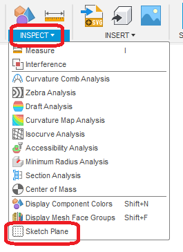
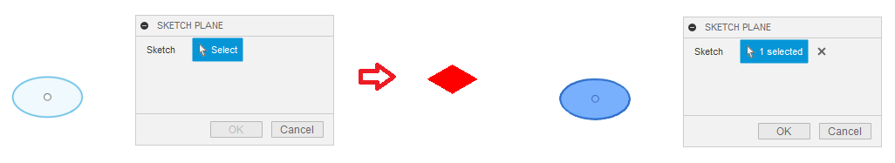
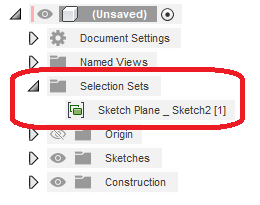
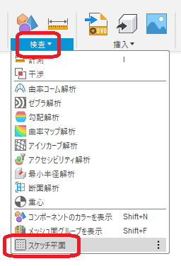
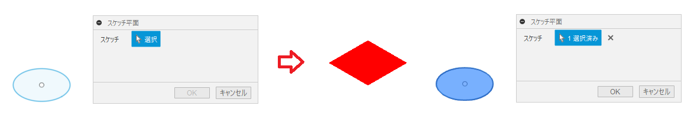
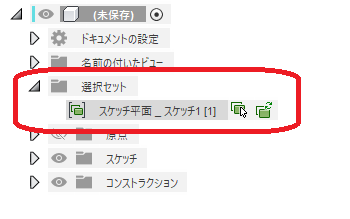

# ***Fusion360_SketchToolPlus SketchPlane***

---

This command is used to check the plane to which the sketch refers/create a selection set.

---
## Panel:

Commands will be added in "Inspect" under "Solid", "Surface", "Mesh" and "Sheet Metal".

  

## Usage:
After the command is executed, a dialog box appears.

While the dialog is displayed, selecting a sketch highlights the plane to which the sketch refers.

  

By pressing the "OK" button, a selection set of referenced planes is created.

  

---

## **Action** :

The following environment is confirmed.

- Fusion360 Ver2.0.16490
- Windows10 64bit Pro , Home

---

# *** 以下は日本語です。***

---

スケッチが参照している平面を確認・選択セットを作成する為のコマンドです。

---
## パネル:

"ソリッド" "サーフェス" "メッシュ" "シートメタル"の"検査"内にコマンドが追加されます。

  

## 使用法:

コマンド実行後、ダイアログが表示されます。

ダイアログを表示している間、スケッチを選択するとスケッチが参照している平面がハイライト表示します。

  

"OK"ボタンを押すことで、参照している平面の選択セットが作成されます。

  )

## アクション:
以下の環境で確認しています。
 + Fusion360 Ver2.0.16490
 + Windows10 64bit Pro , Home