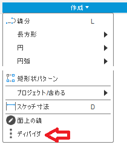
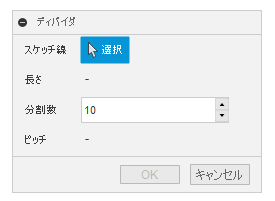

# ***Fusion360_SketchToolPlus ディバイダ***
指定したスケッチ線に等間隔の点を作成します。

***
## パネル:

スケッチ作業スペース時の "作成" に追加されます。

  

## 使用法:

コマンド実行後、ダイアログが表示されます。

  

  + スケッチ線 : 作業中のスケッチ内の直線・曲線を選択してください。

    + 3D曲線もOKです。

    + 他のスケッチの曲線の場合は、事前に "3Dジオメトリを含める" を利用してください。

  + 長さ : 選択された線の長さ

  + 分割数 : 作成する点の数を入力して下さい。

    + 開いている線（直線 等） : 始点-終点間に入力された数の点を作成します。

    + 閉じている線（円 等） : 始点-終点間に入力された数 +1個（終点）の点を作成します。

  + ピッチ : 点-点間の距離

## 残された問題:
  + 再編集が出来ない。

  + 対象となる線は1本の線に制限。

  + スケッチ拘束類の仕様が未確定。
  
## アクション:
以下の環境で確認しています。
 + Fusion360 Ver2.0.9512
 + Windows10 64bit Pro , Home