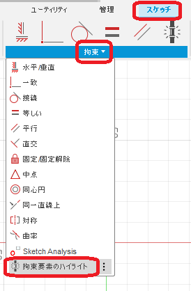
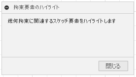
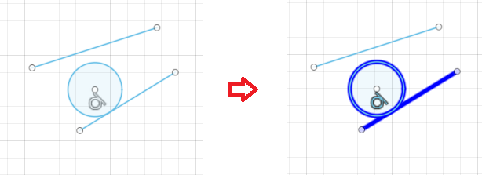

# ***Fusion360_SketchToolPlus 拘束要素のハイライト***
幾何拘束に関連する要素を強調表示します。

***
## パネル:

スケッチ作業スペース時の "拘束" に "拘束要素のハイライト" コマンドが追加されます。

  

## 使用法:

コマンド実行後、ダイアログが表示されます。

  

ダイアログを表示している間、幾何拘束を選択すると関連するスケッチ要素が強めにハイライトされます。

  

## 残された問題:
  + 無し(多分)
  
## アクション:
以下の環境で確認しています。
 + Fusion360 Ver2.0.15291
 + Windows10 64bit Pro , Home