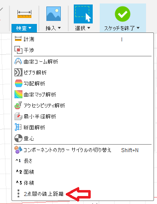
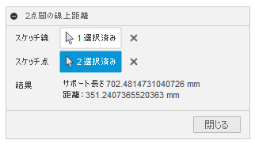

# ***Fusion360_SketchToolPlus 2点間の線上距離***
指定した2点間の線上の距離を測定します。

***
## パネル:

"検査" に追加されます。

  

## 使用法:

コマンド実行後、ダイアログが表示されます。

  

  + スケッチ線 : 測定を行うためのベースとなるスケッチの線を選択して下さい。

  + スケッチ点 : 選択されたスケッチ線上にある点を2個選択して下さい。

  + 結果 : 測定された "サポート長さ" "距離" が表示されます。

## 残された問題:

  + 作業中のスケッチ内の線に対してのみの利用

## アクション:
以下の環境で確認しています。
 + Fusion360 Ver2.0.9512
 + Windows10 64bit Pro , Home