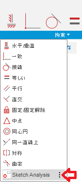
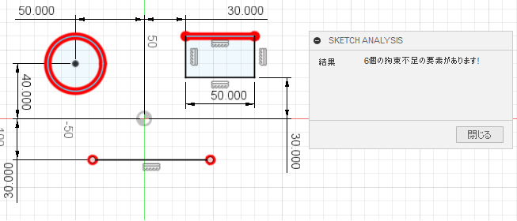
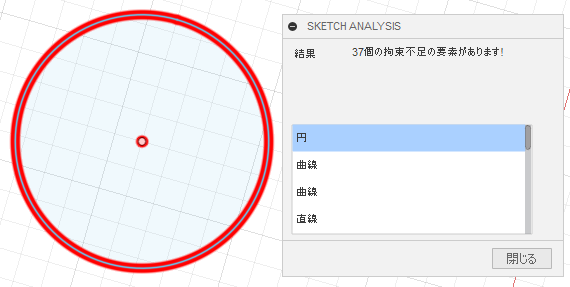

# ***Fusion360_SketchToolPlus SketchAnalysis***
拘束不足のスケッチの形状要素を強調表示します。

***
## パネル:

スケッチ作業スペース時の "拘束" に追加されます。

  

## 使用法:

コマンド実行後、拘束不足の要素が強調表示され、ダイアログには要素数が表示されます。

  

判断される要素は、スケッチの点と線（直線・円弧・スプライン等）でスケッチテキスト(枠は対称)は対象外です。

又、拘束不足となっている要素をリストアップします。

  

リストの項目を選択することで、該当する要素が画面中央に表示されるようにフォーカスします。（ズームはしません）

## 残された問題:
  + 無し
  
## アクション:
以下の環境で確認しています。
 + Fusion360 Ver2.0.9719
 + Windows10 64bit Pro , Home